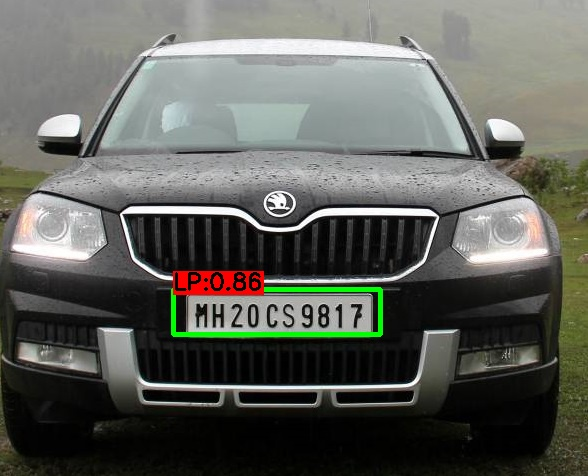

# License-plate-detection
number plate detection using yolo3 and Flask api 
# Description
Python 3.7 or later with the following pip3 install -U -r requirements.txt packages:

    Flask==1.1.1
    opencv-python==4.1.1.26
    tqdm==4.36.1
    numpy==1.17.2
    pandas==0.25.1
# output

